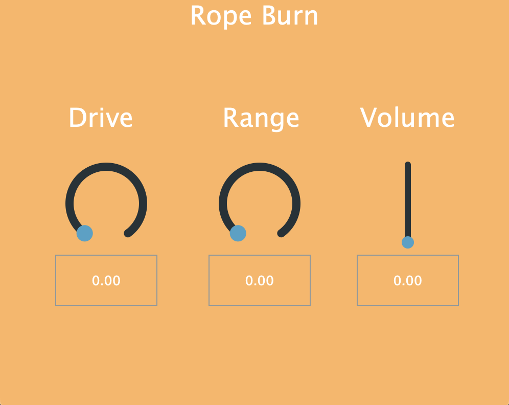
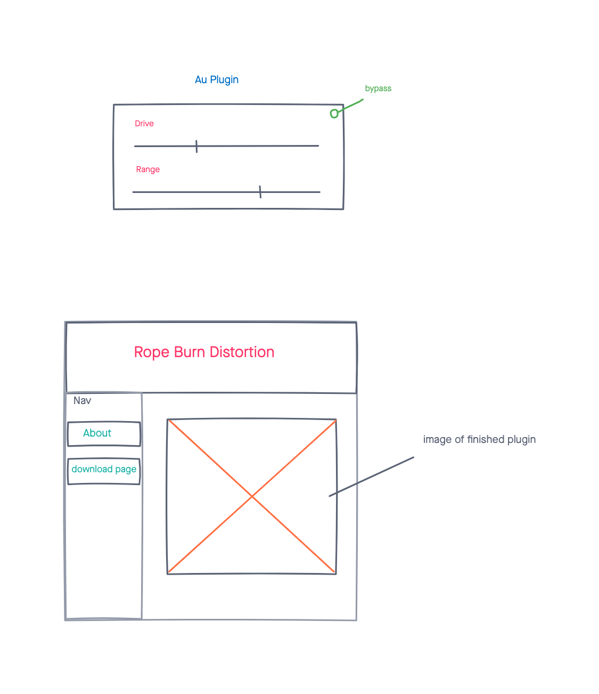

# Rope Burn
a VST3/AU distortion plugin for cross platform use in Digital Audio Workstations for both Mac and PC.
 
 -----
 ## Technologies
 - C++
 - JUCE Framework
 
 ----- 
 ## Screenshot
 the plugin GUI

-----
## Wireframe
original mock up used to get the ball rolling.

----
## Future Enhancements
- bypass button 
- switchable distortion types
- optional lowpass and highpass filters

----
## Getting started
[click here](https://rope-burn.herokuapp.com/) Go to this website to download the plugin zip file. 
The Download page has further instructions for how to get the plugin working on both mac and pc.

